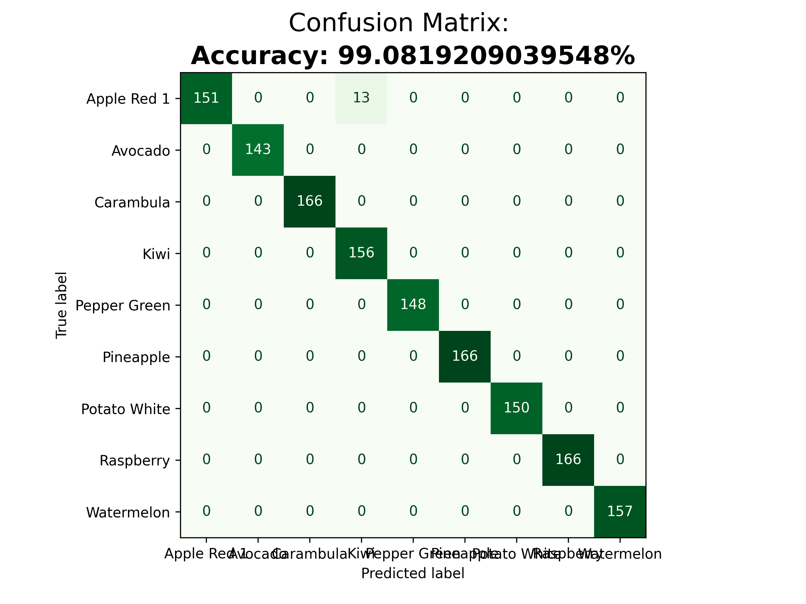

# Classificação de Frutas com Scikit-learn
Arthur Riuiti Pinheiro So  
RA: 1932756

## Dataset
https://www.kaggle.com/datasets/moltean/fruits

## Repositorio
https://github.com/olafmustafar/trabalho-processamento-imagens/

## Classificador
O classificador utilizado foi o SVC (C-Support Vector Classification)  
A acuracia obtida foi `~99%`  


## Instalação
1. Primeiro, é necessario instalar as seguintes bibliotecas (é possível instalar a partir do arquivo requirements.txt)
    - sklearn
    - matplotlib
    - progress
    - numpy

2. Extrair o dataset e colocar a pasta "fruits-360" na raiz do projeto
3. Na raiz do projeto, criar uma pasta chamada "results"
4. Para executar o treinamento e classificação basta executar o comando ```python3 main.py```


